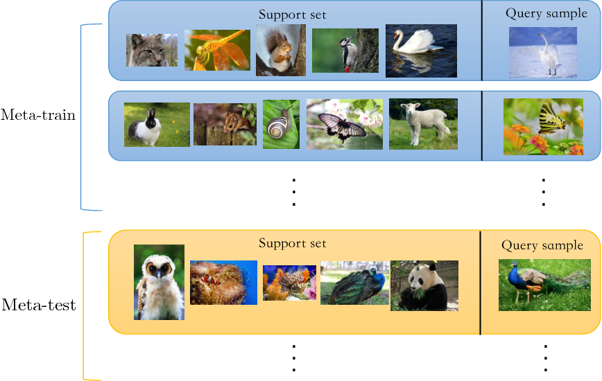

  
# Abstract

## 1. 배경

기존:

Data가 풍부한 상황에서 학습 → data가 적다면?

ex) 사람의 경우 기린 사진 한장으로도 기린에 대한 개념 학습 가능 but 기존의 NN 불가능

overfitting 발생(data augementation이나 regularization으로 overfitting은 방지가능하지만 학습 자체는 힘듬)

해결법? Few shot learning을 가능하게하는 모델을 찾아보자

위의 예시의 경우 하나의 task당 5가지의 class에 대한 1개의 사진들만 주어짐(5 way 1 shot learning)

support set - 각 태스크에 대한 training set

query set - 각 태스크에 대한 test set

제안된 방법들 

1. optimized based
2. model based
3. **metric based** ← 이논문의 접근법

핵심개념 요약:

1. input image를 embedding 하여 vector로 변환
2. 변환된 vector들간의 distance or similarity를 비교하는 effective한 metric을 학습을 통하여 찾겠다.

+) Zero shot learning

few-shot의 경우 support set으로 class마다 최소한 1개이상의 이미지가 보장됨

zero-shot의 경우 support set이 zero-shot 즉 image가 안주어짐, 대신에 해당 동물에 대한 attribute를 나타내는 수치가 주어짐(binary or continuous)

AWA2 dataset 참조 : [https://cvml.ist.ac.at/AwA2/](https://cvml.ist.ac.at/AwA2/)

방식은 few-shot과 유사, attribute를 vector화, query image도 vector화, distance or similarity 계산을 통해 label 결정

## 2. 구조

그림 설명:

5way 1 shot의 한개의 query이미지를 넣었을때의 모델을 시각화한 구조

왼쪽의 5가지 이미지가 support set, 밑의 강아지가 classify 하려는 query set의 image

1. Embedding

    $$f_φ(x_i), f_φ(x_j)$$

    $$f_φ : \text{Embedding module}\newline x_i, x_j : \text{support and query image}$$

    우선적으로 모든 이미지를 각각 Embedding을 시켜준다.

2. Concatenate

    $$C(f_φ(x_i),\ f_φ(x_j))$$

    Embedding 된 모든 vector를 concatenate 연산을 취하여 합쳐준다.

    이때 support image의 vector 하나와 query image의 vector하나씩 전부 연결되도록 해준다

    

    앞의 5가지 vector는 각 support set의 이미지들의 embedding 결과이며, 뒤의 노란색의 vector는 query image의 vector를 각 support image마다 붙인것이다.

3. Relation module

    $$g_\phi(C(f_φ(x_i),\ f_φ(x_j)))$$

    Concat된 vector를 다시 NN모듈을 통하여 classify하여 최종 label을 결정한다.

    여태까지의 과정을 다 합쳐서 나타낸것이 위 식으로, 말로 풀어 표현하자면, j번째 query이미지가 i번째 image의 label로 분류될 relation score를 나타낸 것이다.

    이때 이 relation score가 위 네트워크가 학습할 metric 인 것이다.

    결과적으로 우리는 같은 class에 대해서 relation score가 높아지도록, 다른 class에 대해선 낮아지도록 학습을 진행할 것이다.

4. loss 및 objective function

    논문에선 MSE loss를 사용하였으며 식은 다음과 같다.

    

    결과적으로 위 모델은 i번째 support image와 j번째 query 이미지가 같은 label이면 relation score가 1이 되도록, 다르면 0이 되도록 parameter를 update 해 나간다.

+)Zero-shot learning

$$g_\phi(C(f_{φ1}(x_i),\ f_{φ2}(x_j)))$$

기존의 few-shot learning과 거의 유사하나, support set의 data는 이제 image가 아닌 attribute를 나타낸 vector이므로 query set의 image를 embedding하는 network와 다른 network를 통하여 embedding을 진행한다. (attribute는 FC network 사용, 이미지는 CNN 사용)

# References

Papers:

- [http://openaccess.thecvf.com/content_cvpr_2018/papers/Sung_Learning_to_Compare_CVPR_2018_paper.pdf](http://openaccess.thecvf.com/content_cvpr_2018/papers/Sung_Learning_to_Compare_CVPR_2018_paper.pdf)

Code:

- [https://github.com/floodsung/LearningToCompare_FSL](https://github.com/floodsung/LearningToCompare_FSL)
- [https://github.com/lzrobots/LearningToCompare_ZSL](https://github.com/lzrobots/LearningToCompare_ZSL)

Data:

- AWA2 : [https://cvml.ist.ac.at/AwA2/](https://cvml.ist.ac.at/AwA2/)

Websites:
